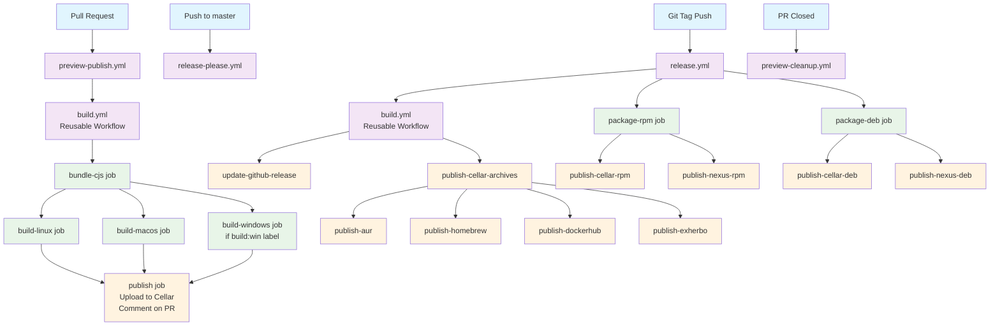

# Contributing to clever-tools

This guide helps you contribute to the clever-tools project, covering the CI/CD workflows and development process.

## Workflow Overview

The project uses GitHub Actions with four main workflows:



### Key Workflows

1. **build.yml** - Reusable workflow that creates cross-platform binaries (Linux, macOS, Windows)
2. **preview-publish.yml** - Builds preview binaries for PRs and publishes download links
3. **release-please.yml** - Creates automated release PRs based on conventional commits
4. **release.yml** - Publishes releases to GitHub, package managers, and repositories

## Development Workflow

### Branch Strategy
- **Main branch**: `master` (protected)
- **Hotfix branches**: `hotfix/**` (triggers release-please)
- **Feature branches**: Use conventional commit format

### Commit Convention
The project uses conventional commits for automated changelog generation:

```
feat: add new functionality
fix: bug fixes
perf: performance improvements
docs: documentation changes
style: code style changes
refactor: code refactoring
test: test changes
chore: maintenance tasks
```

### Custom Changelog Types
The project defines specific changelog sections:
- 🚀 Features (`feat`)
- 🐛 Bug Fixes (`fix`) 
- 💪 Performance Improvements (`perf`)

## Build System

The build process creates cross-platform binaries using:
- **Bundling**: Rollup creates a single `clever.cjs` file
- **Compilation**: @yao-pkg/pkg compiles Node.js binaries for Linux, macOS, and Windows
- **Packaging**: NFPM generates RPM/DEB packages with GPG signing

## Testing Pull Requests

### Preview Builds
Every pull request automatically gets preview builds that can be tested:

1. **Automatic Builds**: Created for all PRs (except docs-only)
2. **Optional Windows**: Add `build:win` label for Windows builds
3. **Download Links**: Posted as PR comments
4. **Testing**: Use preview binaries to test changes
5. **Cleanup**: Automatically removed when PR is closed

### Manual Testing
Contributors can test locally using:
```bash
# Build preview for current branch
scripts/preview.js build

# Manually publish a preview for current branch
scripts/preview.js publish

# List available previews  
scripts/preview.js list

# Update local preview cache
scripts/preview.js update
```

## Troubleshooting

### Common Issues

#### Preview Build Failures
- Ensure PR has non-documentation changes (`.md` files are ignored)
- Add `build:win` label if Windows builds are needed
- Check GitHub Actions logs for detailed error information

#### Build Failures
- Verify Node.js version compatibility (project uses Node 22)
- Check workflow logs in the Actions tab
- Test builds locally using the preview script: `./scripts/preview.js build`

## Contributing Guidelines

1. **Fork and Branch**: Create feature branches from `master`
2. **Conventional Commits**: Use conventional commit format
3. **Test Locally**: Build and test changes locally when possible
4. **Preview Testing**: Use PR preview builds for integration testing
5. **Documentation**: Update relevant documentation for significant changes
6. **Release Notes**: Commit messages will auto-generate changelog entries

## Getting Help

- **GitHub Issues**: Report bugs and request features
- **GitHub Discussions**: Ask questions and share ideas
- **PR Comments**: Get feedback on specific changes
- **CI Logs**: Check workflow logs for detailed error information
